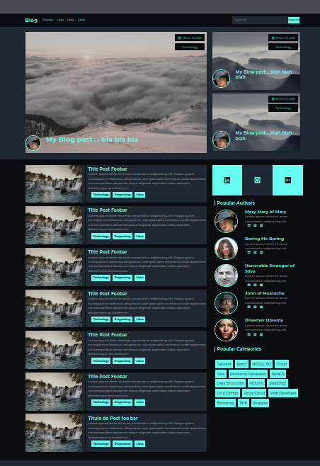
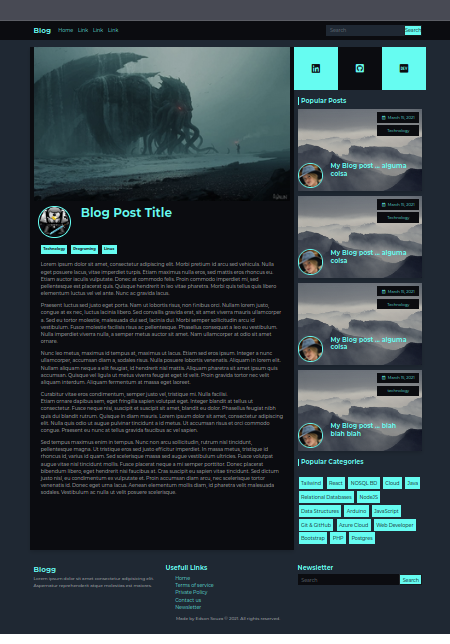

# Projeto

Objetivo: Criação de Front End de um blog para experiências.

# Tecnologias

## Frontend

* HTML5 / CSS3  / JS
* Bootstrap

# Instrutor / Fonte

Lukas Vyhnalek
(https://www.youtube.com/watch?v=EkeOuwF8g8s)

# Telas

## Home Page

## Página de Detalhes

# Autor
Edson souza

[Meu Linkedin](https://www.linkedin.com/in/edsonfrs/)

